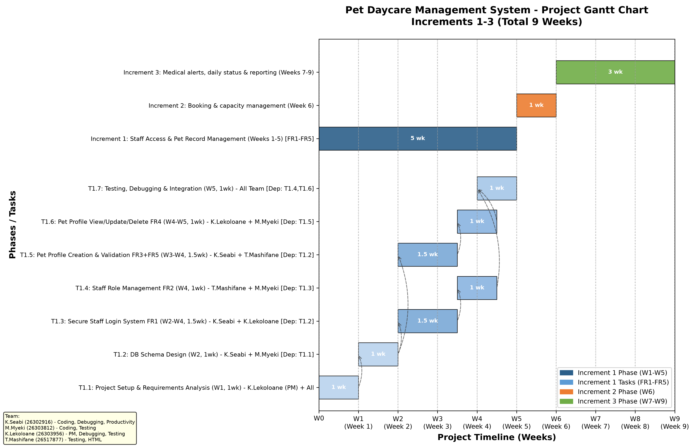
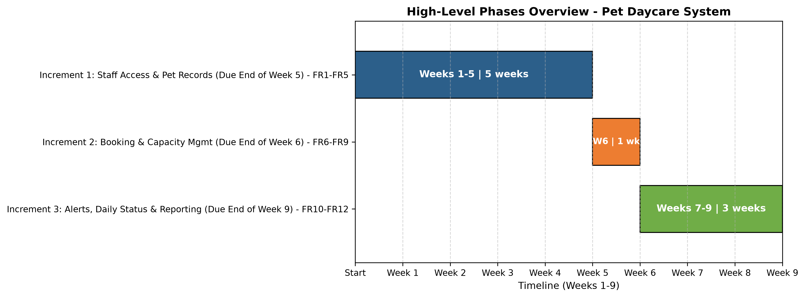

# Pet Daycare Management System - Project Schedule & Gantt Chart

**Team Members:**
- Kamogelo Seabi (26302916) - Interests: Coding and Logic, Debugging | Skills: Productivity & Organization, Collaboration, Problem-Solving, Programming Fundamentals
- Mzukisi Myeki (26303812) - Interests: Coding and Logic, Testing | Skills: Collaboration, Problem-Solving, Programming Fundamentals
- Kamogelo Lekoloane (26303956) - Interests: Coding and Logic, Debugging, Testing | Skills: Collaboration, Project management, Problem-Solving, Programming Fundamentals
- Tlhalefo Mashifane (26517877) - Interests: Coding and logic, Testing | Skills: Programming Fundamentals, Collaboration, Problem solving, Basic HTML

**Tool Used:** Python 3 with **Matplotlib** library (`matplotlib.pyplot.broken_barh`) for Gantt chart generation. 
*Reason:* Free, programmable, allows precise control over dependencies, resource labels, and phase visualization. Alternative tools considered: Microsoft Project, TeamGantt, and GanttProject. Matplotlib was chosen for its flexibility to embed task dependencies and human resource allocations directly on the chart and export high-resolution PNG/PDF.

---

### Introduction to Schedule

This schedule covers the full 9-week development lifecycle for the secure Pet Daycare Records Management System, divided into three increments as defined in the project objectives. The project follows an incremental delivery model to ensure early validation of core security and pet safety features.

**Increment 1 (Weeks 1-5)** focuses on the foundational secure pet records management system (Objectives A) and covers FR1-FR5: staff authentication with failed attempt logging, staff role management, pet profile CRUD, and mandatory emergency vet contact validation. This is the longest increment (5 weeks) because it establishes database schema, security, and core data integrity.

**Increment 2 (Week 6)** delivers booking and capacity management (Objective B) covering FR6-FR9: booking creation linked to pet profiles and automatic capacity blocking.

**Increment 3 (Weeks 7-9)** delivers animal safety alerts and business reporting (Objectives C & D) covering FR10-FR12: medical alert dashboard, daily status tracking (Checked-in, Fed, Exercised, Checked-out), and weekly occupancy/revenue reports.

Resource allocation was based on individual strengths: Kamogelo Lekoloane leads project management and setup (PM skill), Kamogelo Seabi handles logic-heavy tasks (Coding and Logic + Debugging), Mzukisi Myeki focuses on testing and validation, and Tlhalefo Mashifane contributes HTML/UI and testing. All tasks include collaboration.

The Gantt chart below visualizes phase durations, task-level dependencies (dashed arrows), and responsible team members. The critical path for Increment 1 is: T1.1 → T1.2 → T1.3 → T1.4 → T1.7 and parallel path T1.2 → T1.5 → T1.6 → T1.7.

---

### Gantt Chart - Detailed View (with Dependencies & Resources)

### Gantt Chart - High-Level Overview (3 Increments Only)

---

### Detailed Task Breakdown

#### **Increment 1: Staff Access and Pet Record Management - Due End of Week 5 (FR1, FR2, FR3, FR4, FR5)**

This increment ensures Objective A is met: secure login system including breed, age, medical alerts, dietary restrictions, and emergency vet contact.

**T1.1: Project Setup & Requirements Analysis**
- **Duration:** 1 week (Week 1: W0-W1)
- **Resources:** Kamogelo Lekoloane (26303956) as Project Manager + All Team Members (Collaboration)
- **Dependencies:** None (Start Task)
- **Deliverable:** Git repo setup, requirement validation, wireframes for login & pet profile, risk log
- **Skills Used:** Project management, Productivity & Organization

**T1.2: Database Schema Design for Staff & Pet Profiles**
- **Duration:** 1 week (Week 2: W1-W2)
- **Resources:** Kamogelo Seabi (26302916) - Coding and Logic + Mzukisi Myeki (26303812) - Testing mindset for validation rules
- **Dependencies:** T1.1
- **Deliverable:** ERD, Staff table (username, password hash, role, active), Pet table (name, breed, weight, owner details, medical/dietary restrictions, emergency vet contact NOT NULL), Failed login log table
- **Skills Used:** Programming Fundamentals, Problem-Solving

**T1.3: Implement Secure Staff Login System (FR1)**
- **Duration:** 1.5 weeks (Week 2-4: W2-W3.5)
- **Resources:** Kamogelo Seabi (26302916) - Debugging + Kamogelo Lekoloane (26303956) - Debugging
- **Dependencies:** T1.2
- **Deliverable:** Login with unique username/password, bcrypt hashing, session handling, deny & log failed attempts, FR1 acceptance tests
- **Skills Used:** Coding and Logic, Debugging

**T1.4: Implement Staff Role Management (FR2)**
- **Duration:** 1 week (Week 4: W3.5-W4.5)
- **Resources:** Tlhalefo Mashifane (26517877) - Basic HTML for UI + Mzukisi Myeki (26303812) - Testing
- **Dependencies:** T1.3
- **Deliverable:** Manager can create, update, deactivate staff and assign roles (Manager/Staff), role-based access control
- **Skills Used:** Programming Fundamentals, Collaboration, Basic HTML

**T1.5: Develop Pet Profile Creation with Validation (FR3 + FR5)**
- **Duration:** 1.5 weeks (Week 3-4: W2-W3.5) - Parallel with T1.3
- **Resources:** Kamogelo Seabi (26302916) - Logic + Tlhalefo Mashifane (26517877) - HTML forms
- **Dependencies:** T1.2
- **Deliverable:** Create pet profile capturing name, breed, weight, owner detail, medical/dietary restrictions. FR5 enforced: emergency vet contact required, reject save without it with error message.
- **Skills Used:** Coding and Logic, Basic HTML, Problem-Solving

**T1.6: Implement Pet Profile View/Update/Delete (FR4)**
- **Duration:** 1 week (Week 4-5: W3.5-W4.5)
- **Resources:** Kamogelo Lekoloane (26303956) - Collaboration/PM + Mzukisi Myeki (26303812) - Testing
- **Dependencies:** T1.5
- **Deliverable:** List view, search, edit, soft/hard delete with confirmation, audit of changes
- **Skills Used:** Testing, Collaboration, Problem-Solving

**T1.7: Testing, Debugging & Integration for Increment 1**
- **Duration:** 1 week (Week 5: W4-W5)
- **Resources:** All Team - Kamogelo Seabi (Debugging Lead), Kamogelo Lekoloane (Testing Lead), Mzukisi Myeki (Tester), Tlhalefo Mashifane (Tester)
- **Dependencies:** T1.4 AND T1.6 (both tracks must finish)
- **Deliverable:** Unit tests for FR1-FR5, integration test, bug fixes, Increment 1 demo ready, meets Week 5 deadline for Objective A
- **Skills Used:** Debugging, Testing, Collaboration

**Milestone:** End of Week 5 - Increment 1 Complete & Demo (Secure Pet Records System Live)

#### **Increment 2: Booking and Capacity Management - Due End of Week 6 (FR6, FR7, FR8, FR9)**

- **Duration:** 1 week (Week 6: W5-W6)
- **Focus:** Create booking system linking every booking to pet profile (FR8) and automatically stops bookings that exceed daycare's maximum capacity (FR9). Includes FR6 (create booking with stay/end dates, owner contact) and FR7 (view/amend/cancel).
- **Resources (Planned):** Kamogelo Seabi + Mzukisi Myeki (Capacity logic), Tlhalefo Mashifane (Booking UI), Kamogelo Lekoloane (Integration)
- **Dependencies:** Increment 1 must be complete
- **Due Date:** End of Week 6 per Project Objective B

#### **Increment 3: Medical Alerts, Daily Status and Reporting - Due End of Week 9 (FR10, FR11, FR12)**

- **Duration:** 3 weeks (Weeks 7-9: W6-W9)
- **Focus:** Improve animal safety through automated alerts (Objective C) and provide accurate reporting for business management (Objective D). Includes FR10 (medical alert flag dashboard), FR11 (daily status: Checked-in, Fed, Exercised, Checked-out), FR12 (weekly occupancy report: boarded per day, occupancy % vs capacity, peak day)
- **Resources (Planned):** Kamogelo Lekoloane (Dashboard PM), Tlhalefo Mashifane (HTML Dashboard), Kamogelo Seabi (Alert logic), Mzukisi Myeki (Report calculations & Testing)
- **Dependencies:** Increment 2 must be complete
- **Due Date:** End of Week 9 (Week 7 for C, Week 9 for D - combined as Increment 3)

---

### Summary Timeline

| Phase | Name | Duration | Start | End | Due Date | FRs Covered |
|-------|------|----------|-------|-----|----------|-------------|
| Increment 1 | Staff Access & Pet Record Management | 5 weeks | Week 1 | Week 5 | End of Week 5 | FR1-FR5 |
| Increment 2 | Booking & Capacity Management | 1 week | Week 6 | Week 6 | End of Week 6 | FR6-FR9 |
| Increment 3 | Medical Alerts, Daily Status & Reporting | 3 weeks | Week 7 | Week 9 | End of Week 9 | FR10-FR12 |

**Critical Dependencies:** Increment 1 → Increment 2 → Increment 3 (Sequential). Within Increment 1, parallel development is possible for login (T1.3) and pet profile creation (T1.5) after DB design (T1.2).

**Total Project Duration:** 9 weeks

---

*Generated on 2026-05-11 using Python Matplotlib. Files: gantt_chart.png (300 DPI), gantt_chart.pdf, gantt_overview.png*
