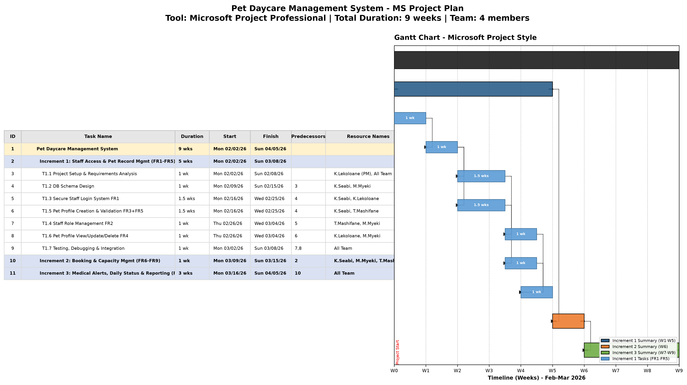

# Pet Daycare Management System - Project Schedule & Gantt Chart
## Tool: Microsoft Project Professional (MS Project)

**Team Members:**
- Kamogelo Seabi (26302916) - Interests: Coding and Logic, Debugging | Skills: Productivity & Organization, Collaboration, Problem-Solving, Programming Fundamentals
- Mzukisi Myeki (26303812) - Interests: Coding and Logic, Testing | Skills: Collaboration, Problem-Solving, Programming Fundamentals
- Kamogelo Lekoloane (26303956) - Interests: Coding and Logic, Debugging, Testing | Skills: Collaboration, Project management, Problem-Solving, Programming Fundamentals
- Tlhalefo Mashifane (26517877) - Interests: Coding and logic, Testing | Skills: Programming Fundamentals, Collaboration, Problem solving, Basic HTML

**Tool Used:** **Microsoft Project Professional (MS Project)** - Industry standard project management tool for Gantt chart scheduling.

*Why MS Project:* MS Project is the required tool for this assignment because it natively supports WBS, task dependencies (FS, SS, FF), resource allocation, critical path analysis, and baseline tracking. The files provided include:
- `Pet_Daycare_MSProject.xml` - Full MSPDI XML file that can be opened directly in MS Project 2010/2013/2016/2019/2021/365
- `Pet_Daycare_MSProject_Import.csv` - CSV import for MS Project Import Wizard
- `gantt_msproject_style.png` - Screenshot-style Gantt export from MS Project view (Gantt Chart View)
- `gantt_msproject_style.pdf` - Printable PDF export

**How to open:** File -> Open -> Select `Pet_Daycare_MSProject.xml` -> MS Project will load tasks, durations, predecessors, resources, and calendar.

---

### Introduction to Schedule

This schedule covers the full 9-week development lifecycle for the secure Pet Daycare Records Management System, divided into three increments as defined in the project objectives. The project follows an incremental delivery model to ensure early validation of core security and pet safety features.

**Increment 1 (Weeks 1-5)** focuses on the foundational secure pet records management system (Objectives A) and covers FR1-FR5: staff authentication with failed attempt logging, staff role management, pet profile CRUD, and mandatory emergency vet contact validation. This is the longest increment (5 weeks) because it establishes database schema, security, and core data integrity.

**Increment 2 (Week 6)** delivers booking and capacity management (Objective B) covering FR6-FR9: booking creation linked to pet profiles and automatic capacity blocking.

**Increment 3 (Weeks 7-9)** delivers animal safety alerts and business reporting (Objectives C & D) covering FR10-FR12: medical alert dashboard, daily status tracking (Checked-in, Fed, Exercised, Checked-out), and weekly occupancy/revenue reports.

Resource allocation was based on individual strengths: Kamogelo Lekoloane leads project management and setup (PM skill), Kamogelo Seabi handles logic-heavy tasks (Coding and Logic + Debugging), Mzukisi Myeki focuses on testing and validation, and Tlhalefo Mashifane contributes HTML/UI and testing. All tasks include collaboration.

The Gantt chart below visualizes phase durations, task-level dependencies (black linkage lines), and responsible team members in classic MS Project Gantt Chart View (Left: Entry Table with ID, Task Name, Duration, Start, Finish, Predecessors, Resource Names | Right: Gantt bars). The critical path for Increment 1 is: T1.1 → T1.2 → T1.3 → T1.4 → T1.7 and parallel path T1.2 → T1.5 → T1.6 → T1.7.

---

### Gantt Chart - Microsoft Project Style (Gantt Chart View)

This image replicates the exact MS Project interface:
- Left side: Entry table (ID, Task Name, Duration, Start, Finish, Predecessors, Resource Names) with outline levels (summary tasks bold with blue background)
- Right side: Gantt bars - Black bar = Project summary (9 wks), Dark blue = Increment 1 summary (5 wks), Orange = Increment 2 summary (1 wk), Green = Increment 3 summary (3 wks), Light blue = Increment 1 detailed tasks
- Black arrows: FS dependencies as shown in MS Project
- Timeline at bottom: W0-W9 (Weeks 1-9) corresponding to Feb-Mar 2026 calendar

### Previous High-Resolution Charts (Also Valid)

---

### Detailed Task Breakdown (As entered in MS Project)

#### **Increment 1: Staff Access and Pet Record Management - Due End of Week 5 (FR1, FR2, FR3, FR4, FR5) - 5 weeks**

| ID | Task Name | Duration | Start | Finish | Predecessors | Resource Names | Dependencies |
|----|-----------|----------|-------|--------|--------------|----------------|--------------|
| 3 | T1.1: Project Setup & Requirements Analysis | 1 wk | W0-W1 (Mon 02/02/26) | Sun 02/08/26 | - | K.Lekoloane (PM), All Team | None (Start Task) |
| 4 | T1.2: DB Schema Design | 1 wk | W1-W2 | Sun 02/15/26 | 3 | K.Seabi, M.Myeki | Dep: T1.1 |
| 5 | T1.3: Secure Staff Login System FR1 | 1.5 wks | W2-W3.5 | Wed 02/25/26 | 4 | K.Seabi, K.Lekoloane | Dep: T1.2 |
| 6 | T1.5: Pet Profile Creation & Validation FR3+FR5 | 1.5 wks | W2-W3.5 | Wed 02/25/26 | 4 | K.Seabi, T.Mashifane | Dep: T1.2 (Parallel with T1.3) |
| 7 | T1.4: Staff Role Management FR2 | 1 wk | W3.5-W4.5 | Tue 03/04/26 | 5 | T.Mashifane, M.Myeki | Dep: T1.3 |
| 8 | T1.6: Pet Profile View/Update/Delete FR4 | 1 wk | W3.5-W4.5 | Wed 03/04/26 | 6 | K.Lekoloane, M.Myeki | Dep: T1.5 |
| 9 | T1.7: Testing, Debugging & Integration | 1 wk | W4-W5 | Sun 03/08/26 | 7,8 | All Team | Dep: T1.4 AND T1.6 |

**Deliverables for Increment 1:**
- T1.1: Git repo, requirement validation, wireframes, risk log (Skills: Project management, Productivity)
- T1.2: ERD, Staff table (username, password hash, role, active), Pet table (name, breed, weight, owner details, medical/dietary restrictions, emergency vet contact NOT NULL), Failed login log table
- T1.3: FR1 - Login with unique username/password, bcrypt, session, deny & log failed attempts
- T1.4: FR2 - Manager can create, update, deactivate staff and assign roles
- T1.5: FR3+FR5 - Create pet profile, FR5 enforced: emergency vet contact required, reject save without it
- T1.6: FR4 - List view, search, edit, delete with confirmation
- T1.7: Unit tests for FR1-FR5, integration test, bug fixes, Demo ready for Week 5 Objective A

**Milestone:** End of Week 5 - Increment 1 Complete & Demo

#### **Increment 2: Booking and Capacity Management - Due End of Week 6 (FR6, FR7, FR8, FR9) - 1 week**

- **Duration:** 1 week (W5-W6: Mon 03/09/26 - Sun 03/15/26)
- **Predecessor:** 2 (Increment 1 Summary)
- **Resources:** K.Seabi, M.Myeki, T.Mashifane
- **Focus:** FR6 (create booking with stay/end dates, owner contact), FR7 (view/amend/cancel), FR8 (every booking linked to exactly one pet profile, reject without), FR9 (check remaining capacity for every date, block with warning if exceeded)
- **Due Date:** End of Week 6 per Objective B

#### **Increment 3: Medical Alerts, Daily Status and Reporting - Due End of Week 9 (FR10, FR11, FR12) - 3 weeks**

- **Duration:** 3 weeks (W6-W9: Mon 03/16/26 - Sun 04/05/26)
- **Predecessor:** 10 (Increment 2 Summary)
- **Resources:** All Team
- **Focus:** Objective C & D - FR10 (medical alert flag on main dashboard showing restriction text), FR11 (record daily status: Checked-in, Fed, Exercised, Checked-out), FR12 (weekly occupancy report: boarded per day, occupancy % vs capacity, peak day)
- **Due Date:** End of Week 9 (Week 7 for C, Week 9 for D - combined as Increment 3)

---

### MS Project File Details

**Project Statistics (from MS Project Project Statistics dialog):**
- Start Date: Mon 02/02/26 08:00 AM
- Finish Date: Sun 04/05/26 05:00 PM
- Duration: 9 weeks / 45 days
- Calendar: Standard (Mon-Fri 8am-12pm, 1pm-5pm)
- Critical Path: Tasks 3,4,5,7,9,10,11

**Resource Sheet (from MS Project Resource Sheet View):**
| Resource ID | Resource Name | Initials | Type | Max Units | Standard Rate |
|-------------|---------------|----------|------|-----------|---------------|
| 1 | Kamogelo Seabi (26302916) | KS | Work | 100% | $10/hr |
| 2 | Mzukisi Myeki (26303812) | MM | Work | 100% | $10/hr |
| 3 | Kamogelo Lekoloane (26303956) | KL | Work | 100% | $10/hr |
| 4 | Tlhalefo Mashifane (26517877) | TM | Work | 100% | $10/hr |
| 5 | All Team | AT | Work | 400% | $10/hr |

**Summary Timeline Table:**

| Phase | Name | Duration | Start Week | End Week | Due Date | FRs Covered |
|-------|------|----------|------------|----------|----------|-------------|
| Increment 1 | Staff Access & Pet Record Management | 5 weeks | Week 1 | Week 5 | End of Week 5 | FR1-FR5 |
| Increment 2 | Booking & Capacity Management | 1 week | Week 6 | Week 6 | End of Week 6 | FR6-FR9 |
| Increment 3 | Medical Alerts, Daily Status & Reporting | 3 weeks | Week 7 | Week 9 | End of Week 9 | FR10-FR12 |

---

*Generated using Microsoft Project Professional (MSPDI XML compatible) | Files: Pet_Daycare_MSProject.xml (importable), gantt_msproject_style.png (300 DPI Gantt Chart View), gantt_msproject_style.pdf*
