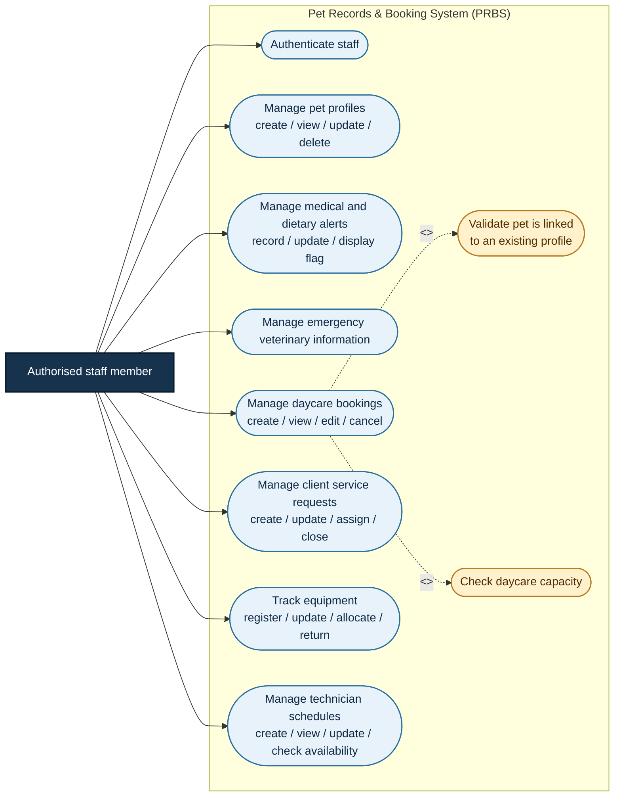
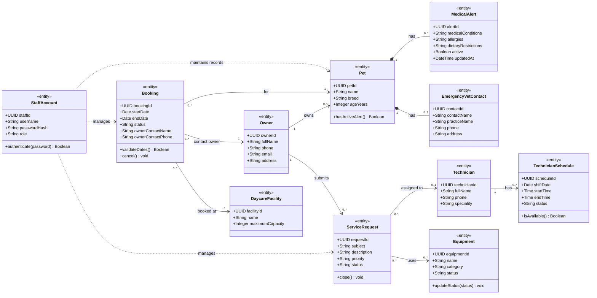

# SDP152 – Case Study 3
## Pet Records & Booking System (PRBS)

This document summarises the PRBS use cases and core classes. The diagrams include the eight numbered pet-record and booking requirements as well as the previously supplied operational areas: client service requests, equipment tracking, and technician schedules.

> **Modelling approach:** the diagrams use high-level `Manage` use cases so that the main responsibilities are visible without repeating every create, view, update, and delete action. The actions included in each high-level use case are listed in the table below.

## Modelling assumptions

- Authorised staff members are the primary system users and must log in before using protected functions.
- Owners/clients provide information, but staff maintain the records in PRBS.
- Each booking is linked to one existing pet and must pass a daycare capacity check before it is saved.
- A pet may have several alerts and one emergency veterinary contact. Active alerts are shown on the dashboard.
- A service request may be assigned to one technician and may use equipment. Technicians may have several schedule records.

---

# 1. Use case diagram

The use case diagram groups related actions into eight manageable areas. The only separate booking use cases are the two validations that must happen before a booking is saved.

### Use case summary

| ID | High-level use case | Main actions included | Requirement / scope |
|---|---|---|---|
| UC-01 | Authenticate staff | Log in with a secure username and password | Requirement 1 |
| UC-02 | Manage pet profiles | Create, view, update, and delete pet name, breed, age, and owner details | Requirement 2 |
| UC-03 | Manage medical and dietary alerts | Record and update conditions, allergies, dietary restrictions, and display active flags | Requirements 3–4 |
| UC-04 | Manage emergency veterinary information | Capture and update the pet's emergency veterinary contact | Requirement 8 |
| UC-05 | Manage daycare bookings | Create, view, edit, and cancel bookings, including dates and owner contact details | Requirement 5 |
| UC-06 | Validate booking pet link | Confirm that every booking references one existing pet profile | Requirement 6; included in UC-05 |
| UC-07 | Check daycare capacity | Compare requested dates with maximum facility capacity | Requirement 7; included in UC-05 |
| UC-08 | Manage client service requests | Create, view, update, assign to a technician, and close requests | Previously supplied operational scope |
| UC-09 | Track equipment | Register equipment, update status, allocate it to a request, and return it | Previously supplied operational scope |
| UC-10 | Manage technician schedules | Create, view, and update schedules and check technician availability | Previously supplied operational scope |

### Assignment 1 updates

The updated version keeps the original functional areas and adds the missing operational scope. Pet CRUD, alert management, emergency veterinary information, and booking management are shown as high-level use cases, while the pet-link and capacity rules remain explicit included validations. This keeps the diagram complete but easier to read.

---

# 2. Class diagram

The class diagram focuses on the core records rather than showing every application service. `Pet`, `Booking`, `ServiceRequest`, `Equipment`, and `TechnicianSchedule` are the main operational records. The relationships show ownership, bookings, alert information, request assignment, equipment allocation, and technician availability.

### Class diagram summary

| Class / group | Purpose |
|---|---|
| `StaffAccount` | Authenticates authorised staff. |
| `Owner`, `Pet`, `MedicalAlert`, `EmergencyVetContact` | Store owner and pet profile information, including alerts and emergency veterinary details. |
| `Booking`, `DaycareFacility` | Store daycare stays and the facility capacity used during booking validation. |
| `ServiceRequest` | Stores client requests and their priority, status, and technician assignment. |
| `Equipment` | Tracks equipment status and use by service requests. |
| `Technician`, `TechnicianSchedule` | Store technician details and working availability. |

### Key relationships and rules

- Every `Booking` is linked to exactly one existing `Pet` and one `Owner`.
- A `Pet` may have multiple alerts, but only active alerts are displayed.
- A `ServiceRequest` may be assigned to zero or one `Technician` and may use multiple pieces of equipment.
- A `Technician` may have multiple schedule records.
- `StaffAccount` represents the authorised staff actor who maintains the records; it is not an owner or pet.

## Diagram source files

- [`docs/prbs-use-case.puml`](docs/prbs-use-case.puml)
- [`docs/prbs-class-diagram.puml`](docs/prbs-class-diagram.puml)
