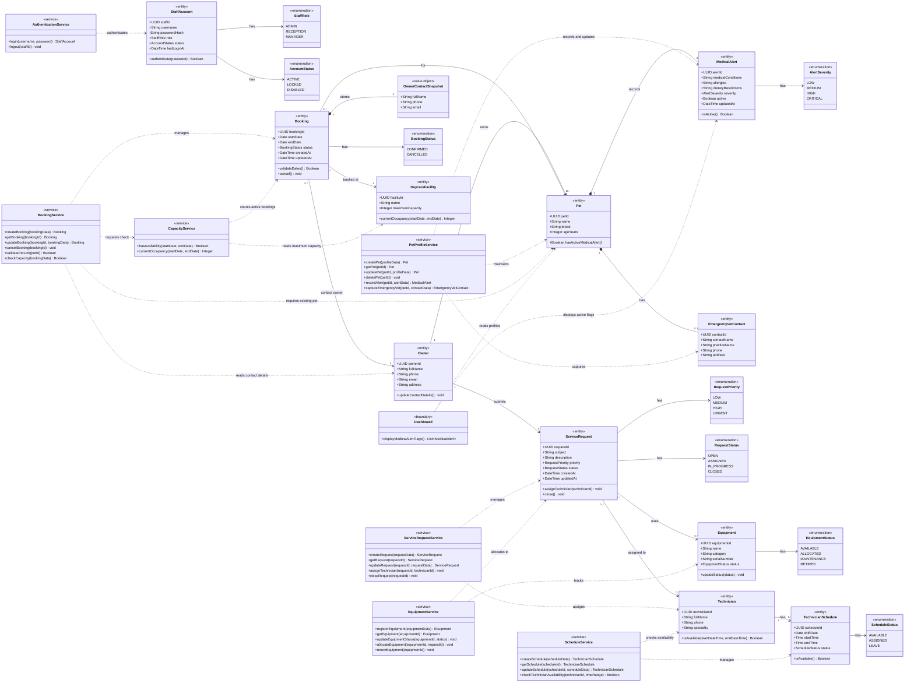

# SDP152 – Case Study 3
## Pet Records & Booking System (PRBS)

This document contains the use case and class diagrams for the Pet Records & Booking System. The diagrams are based on the eight functional requirements supplied for this case study.

> **Scope note.** In addition to the eight PRBS requirements, the previously supplied case-study use case includes client service requests, equipment tracking, and technician schedules. Those operational areas are included in the updated diagrams below. The eight numbered requirements remain the detailed rules for pet records, alerts, and bookings; the operational use cases are modelled at the management level where no further field-level rules were supplied.

## Modelling assumptions

- The only human actor in the supplied requirements is an **authorised staff member**. Owners provide information, but staff members enter and maintain it, so owners are not modelled as system users.
- A staff member must successfully log in before using any protected PRBS function.
- A pet has one owner and may have zero or more bookings and alert records.
- A booking must reference exactly one existing pet. A booking cannot be saved with a missing or unknown pet.
- Capacity is checked for the booking's date range. A booking is rejected when accepting it would exceed the daycare facility's maximum capacity.
- A medical or dietary alert is considered active when it contains a current condition, allergy, or dietary restriction. Active alerts are shown on the dashboard.
- Emergency veterinary information belongs to the pet profile and may be updated by staff.
- Owner contact details are stored on the owner profile and captured as a snapshot on a booking so that the contact information used for that booking remains available.
- Client service requests, equipment records, and technician schedules are managed by authorised staff. A service request can be assigned to a technician and can reference allocated equipment.
- Technicians are represented as operational users of assigned requests and schedules; the supplied requirements do not define a separate client login workflow.

---

# 1. Use case diagram

```mermaid
flowchart LR
    Staff["Authorised staff member"]

    subgraph PRBS["Pet Records & Booking System (PRBS)"]
        direction TB

        Login(["Log in"])
        Credentials(["Validate username and password"])

        CreatePet(["Create pet profile"])
        ViewPet(["View pet profile"])
        UpdatePet(["Update pet profile"])
        DeletePet(["Delete pet profile"])
        Alerts(["Record or update medical and dietary alerts"])
        EmergencyVet(["Capture emergency veterinary information"])

        Dashboard(["View dashboard"])
        AlertFlag(["Display medical alert flag"])

        CreateBooking(["Create daycare booking"])
        ViewBooking(["View booking"])
        EditBooking(["Edit booking"])
        CancelBooking(["Cancel booking"])
        LinkPet(["Link booking to one existing pet"])
        Capacity(["Check available daycare capacity"])

        ManageRequests(["Manage client service requests"])
        CreateRequest(["Create service request"])
        ViewRequest(["View service request"])
        UpdateRequest(["Update service request"])
        AssignRequest(["Assign request to technician"])
        CloseRequest(["Close service request"])

        TrackEquipment(["Track equipment"])
        RegisterEquipment(["Register equipment"])
        UpdateEquipment(["Update equipment status"])
        AllocateEquipment(["Allocate equipment to request"])
        ReturnEquipment(["Return equipment"])

        ManageSchedules(["Manage technician schedules"])
        CreateSchedule(["Create technician schedule"])
        ViewSchedule(["View technician schedule"])
        UpdateSchedule(["Update technician schedule"])
        CheckAvailability(["Check technician availability"])
    end

    Staff --> Login
    Staff --> CreatePet
    Staff --> ViewPet
    Staff --> UpdatePet
    Staff --> DeletePet
    Staff --> Alerts
    Staff --> EmergencyVet
    Staff --> Dashboard
    Staff --> CreateBooking
    Staff --> ViewBooking
    Staff --> EditBooking
    Staff --> CancelBooking
    Staff --> ManageRequests
    Staff --> CreateRequest
    Staff --> ViewRequest
    Staff --> UpdateRequest
    Staff --> AssignRequest
    Staff --> CloseRequest
    Staff --> TrackEquipment
    Staff --> RegisterEquipment
    Staff --> UpdateEquipment
    Staff --> AllocateEquipment
    Staff --> ReturnEquipment
    Staff --> ManageSchedules
    Staff --> CreateSchedule
    Staff --> ViewSchedule
    Staff --> UpdateSchedule
    Staff --> CheckAvailability

    ManageRequests -.->|"<<include>>"| CreateRequest
    ManageRequests -.->|"<<include>>"| ViewRequest
    ManageRequests -.->|"<<include>>"| UpdateRequest
    ManageRequests -.->|"<<include>>"| AssignRequest
    ManageRequests -.->|"<<include>>"| CloseRequest
    TrackEquipment -.->|"<<include>>"| RegisterEquipment
    TrackEquipment -.->|"<<include>>"| UpdateEquipment
    TrackEquipment -.->|"<<include>>"| AllocateEquipment
    TrackEquipment -.->|"<<include>>"| ReturnEquipment
    ManageSchedules -.->|"<<include>>"| CreateSchedule
    ManageSchedules -.->|"<<include>>"| ViewSchedule
    ManageSchedules -.->|"<<include>>"| UpdateSchedule
    ManageSchedules -.->|"<<include>>"| CheckAvailability

    Login -.->|"<<include>>"| Credentials
    CreateBooking -.->|"<<include>>"| LinkPet
    CreateBooking -.->|"<<include>>"| Capacity
    EditBooking -.->|"<<include when dates change>>"| Capacity
    AlertFlag -.->|"<<extend: active alert exists>>"| Dashboard

    classDef actor fill:#17324d,stroke:#0b1f33,color:#ffffff,stroke-width:2px;
    classDef usecase fill:#e7f2fb,stroke:#2b6f9f,color:#102a43,stroke-width:1.5px;
    classDef validation fill:#fff1cc,stroke:#b7791f,color:#4a2c00,stroke-width:1.5px;
    class Staff actor;
    class Login,CreatePet,ViewPet,UpdatePet,DeletePet,Alerts,EmergencyVet,Dashboard,AlertFlag,CreateBooking,ViewBooking,EditBooking,CancelBooking,ManageRequests,CreateRequest,ViewRequest,UpdateRequest,AssignRequest,CloseRequest,TrackEquipment,RegisterEquipment,UpdateEquipment,AllocateEquipment,ReturnEquipment,ManageSchedules,CreateSchedule,ViewSchedule,UpdateSchedule,CheckAvailability usecase;
    class Credentials,LinkPet,Capacity validation;
```

The diagram expands the broad requirements into the staff interactions needed to operate PRBS. CRUD operations are shown separately so that each responsibility is explicit. It also retains the previously supplied operational use cases for client service requests, equipment tracking, and technician schedules. The two mandatory booking validations are modelled as `<<include>>` relationships: linking the booking to an existing pet and checking capacity happen before a booking is saved. The dashboard alert is a conditional extension of viewing the dashboard.

### Use case descriptions and requirement traceability

| ID | Use case | Primary actor | Requirement coverage | Result / rule |
|---|---|---|---|---|
| UC-01 | Log in | Authorised staff member | 1 | Credentials are validated before protected functions are available. |
| UC-02 | Create, view, update, and delete pet profile | Authorised staff member | 2 | The profile stores the pet name, breed, age, and owner details. |
| UC-03 | Record or update medical and dietary alerts | Authorised staff member | 3 | Conditions, allergies, and dietary restrictions are stored against the pet. |
| UC-04 | View dashboard and display medical alert flag | Authorised staff member | 4 | An active alert is prominently flagged whenever the dashboard is viewed. |
| UC-05 | Create, view, edit, and cancel daycare booking | Authorised staff member | 5 | The booking stores stay dates, owner contact information, and status. |
| UC-06 | Link booking to one existing pet | PRBS during booking save | 6 | The save is rejected unless the referenced pet already exists. |
| UC-07 | Check available daycare capacity | PRBS during booking save | 7 | The save is rejected when the date range would exceed maximum capacity. |
| UC-08 | Capture emergency veterinary information | Authorised staff member | 8 | Emergency veterinary contact details are stored on the pet profile. |
| UC-09 | Manage client service requests | Authorised staff member | Previously supplied use case | Requests can be created, viewed, updated, assigned to a technician, and closed. |
| UC-10 | Track equipment | Authorised staff member | Previously supplied use case | Equipment can be registered, status-tracked, allocated to a request, and returned. |
| UC-11 | Manage technician schedules | Authorised staff member | Previously supplied use case | Technician schedules can be created, viewed, updated, and checked for availability. |

### Booking validation flow

1. The staff member selects an existing pet and enters the stay dates and owner contact information.
2. PRBS verifies that the pet reference identifies one existing pet.
3. PRBS calculates occupancy for the requested date range and compares it with the facility maximum.
4. Only when both checks pass is the booking saved. If either check fails, the staff member receives a validation error and no booking is created or updated.

### Assignment 1 updates represented here

No Assignment 1 artefact was present in the supplied repository. The following detail has been made explicit in this version so the diagram is traceable to the supplied brief:

- pet profile maintenance is decomposed into create, view, update, and delete interactions;
- alert capture is separated from the dashboard flag that displays the result;
- the emergency veterinary information interaction is included in the pet-profile area;
- booking-to-pet validation and daycare capacity validation are explicit included use cases;
- authentication is shown as a prerequisite for protected staff functions; and
- the previously supplied client service request, equipment tracking, and technician scheduling use cases are retained and expanded into their main staff actions.

---

# 2. Class diagram

The class diagram separates the core records from the services that enforce the business rules. `Pet`, `Owner`, `MedicalAlert`, `EmergencyVetContact`, and `Booking` represent the PRBS records; `ServiceRequest`, `Equipment`, `Technician`, and `TechnicianSchedule` represent the operational records from the previously supplied use case. The service classes coordinate authentication, profile maintenance, booking validation, capacity checks, request management, equipment tracking, scheduling, and dashboard alert display. Multiplicities show the required booking-to-pet link, the one-owner relationship, request assignments, and schedule ownership.

### Class responsibilities and constraints

| Class / group | Responsibility |
|---|---|
| `StaffAccount` and enumerations | Stores authorised staff credentials and account state. The password is represented as a hash rather than plaintext. |
| `Owner` | Stores owner identity and contact details used by pet profiles and bookings. |
| `Pet` | Stores the required pet profile data and acts as the parent for medical alerts and emergency veterinary information. |
| `MedicalAlert` | Stores medical conditions, allergies, and dietary restrictions, including severity and whether the alert is active. |
| `EmergencyVetContact` | Stores the emergency veterinary contact captured for a pet. |
| `Booking` | Stores stay dates, status, the required pet reference, owner reference, and a contact snapshot. |
| `DaycareFacility` and `CapacityService` | Represent maximum capacity and the occupancy check used before a booking is saved. |
| `ServiceRequest` and `ServiceRequestService` | Store and manage client service requests, including assignment to a technician and closure. |
| `Equipment` and `EquipmentService` | Register equipment, maintain its status, and allocate or return it for a service request. |
| `Technician` and `TechnicianSchedule` | Store technician details, working periods, availability, and schedule status. |
| `ScheduleService` | Creates and updates schedules and checks technician availability before assignment. |
| `AuthenticationService` | Enforces the login prerequisite. |
| `PetProfileService` | Performs pet CRUD operations and captures alert and emergency veterinary data. |
| `BookingService` | Performs booking CRUD/cancellation and coordinates pet-link and capacity validation. |
| `Dashboard` | Reads active alerts and presents the medical alert flag to staff. |

### Important multiplicities

- `Booking "0..*" --> "1" Pet`: every booking has exactly one existing pet; a pet may have many bookings over time.
- `Owner "1" --> "0..*" Pet`: every pet has one owner; an owner may have multiple pets.
- `Pet "1" *-- "0..*" MedicalAlert`: a pet may have no alerts or several alert records; only active records are shown on the dashboard.
- `Booking "1" *-- "1" OwnerContactSnapshot`: every booking retains the owner contact information used for that booking.
- `Booking "0..*" --> "1" DaycareFacility`: capacity is evaluated against the facility where the booking is made.
- `ServiceRequest "0..*" --> "0..1" Technician`: a request may be unassigned while open, then assigned to at most one technician.
- `Technician "1" --> "0..*" TechnicianSchedule`: a technician may have many schedule records, while each schedule belongs to one technician.
- `ServiceRequest "0..*" --> "0..*" Equipment`: equipment may be allocated to requests over time and can be returned when work is complete.

## Diagram source files

The standalone PlantUML source files are included alongside this document for editing or rendering:

- [`docs/prbs-use-case.puml`](docs/prbs-use-case.puml)
- [`docs/prbs-class-diagram.puml`](docs/prbs-class-diagram.puml)
