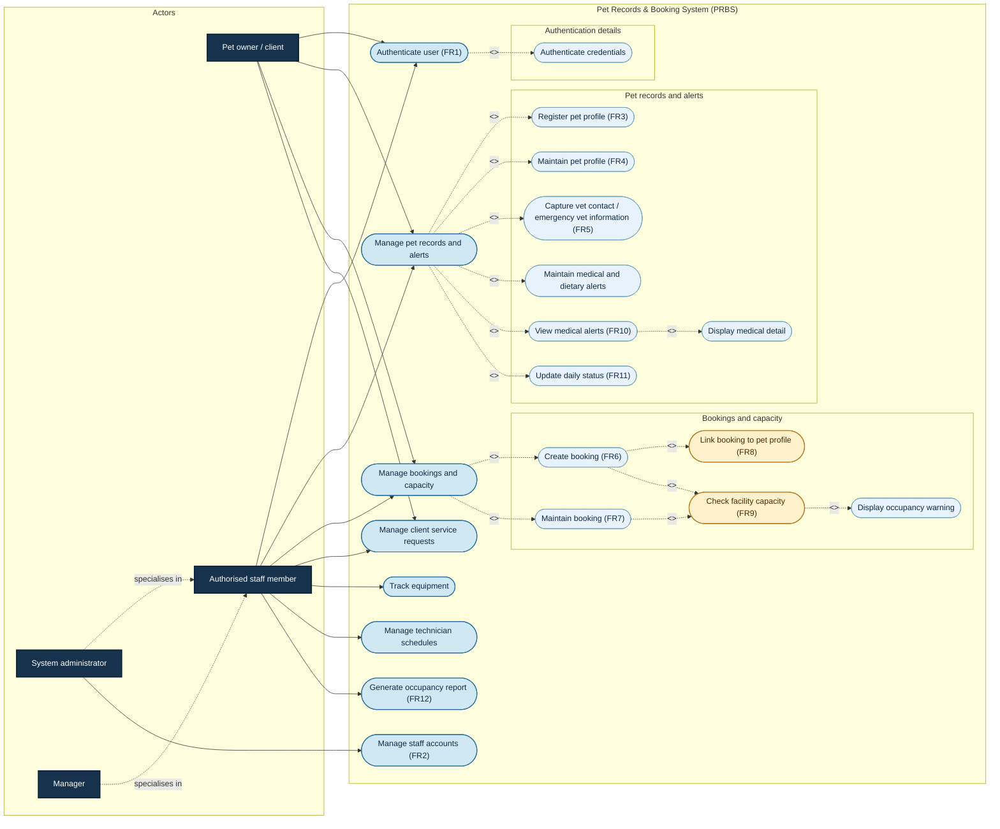
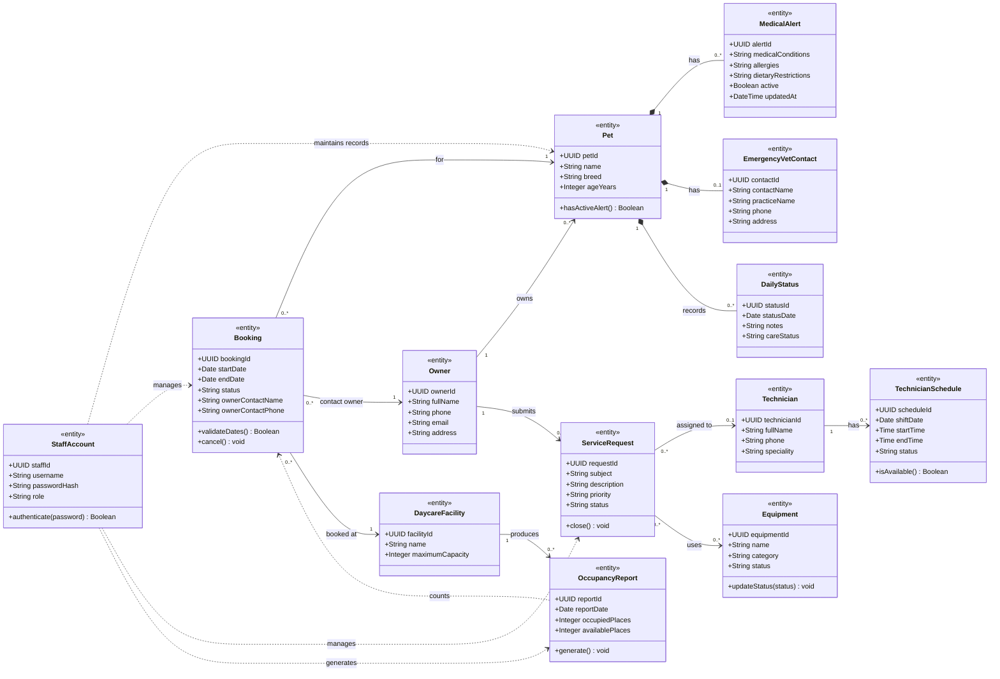

# SDP152 – Case Study 3
## Pet Records & Booking System (PRBS)

This document combines the current PRBS use case with the previously supplied use case image. It retains the image's FR1–FR12 functions and the additional operational areas: client service requests, equipment tracking, and technician schedules.

> **Modelling approach:** the diagram is grouped by business area to keep it readable. Related actions are shown as separate use cases where they were identified in the supplied reference diagram; the summary table explains the scope of each one.

## Modelling assumptions

- The main actors are the **pet owner/client**, **authorised staff member**, **system administrator**, and **manager**.
- All actors who access protected functions authenticate before using them. System administrators and managers are specialised staff roles.
- Pet owners submit and view their own pet, booking, alert, and service-request information; staff maintain the records.
- Each booking is linked to one existing pet and must pass a facility capacity check before it is saved.
- A pet may have several alerts and daily-status records, plus one emergency veterinary contact.
- A service request may be assigned to one technician and may use equipment. Technicians may have several schedule records.

---

# 1. Use case diagram

The following diagram combines the supplied reference use cases with the PRBS requirements and operational scope. The FR labels from the reference are retained. Actor arrows connect to summary use cases so that they do not cross over the detailed cases; the detailed cases are linked inside the system boundary. Required details and booking validations are shown as `<<include>>` relationships, while the conditional occupancy warning is shown as an `<<extend>>` relationship.

### Combined use case summary

| ID | Use case | Summary | Source / coverage |
|---|---|---|---|
| FR1 | Log in | Staff authenticate with a secure username and password. | Reference diagram; Requirement 1 |
| FR2 | Manage staff accounts | Maintain authorised staff accounts and access. | Reference diagram |
| FR3 | Register pet profile | Create a new pet profile with name, breed, age, and owner details. | Reference diagram; Requirement 2 |
| FR4 | Maintain pet profile | View, update, or delete an existing pet profile. | Reference diagram; Requirement 2 |
| FR5 | Capture vet contact | Store and update emergency veterinary contact information. | Reference diagram; Requirement 8 |
| FR6 | Create booking | Create a daycare booking with stay dates and owner contact information. | Reference diagram; Requirement 5 |
| FR7 | Maintain booking | View, edit, or cancel an existing booking. | Reference diagram; Requirement 5 |
| FR8 | Link booking to pet profile | Require every booking to reference one existing pet. | Reference diagram; Requirement 6 |
| FR9 | Check facility capacity | Prevent a booking when the requested dates exceed maximum capacity. | Reference diagram; Requirement 7 |
| FR10 | View medical alerts | Show medical and dietary alerts for a pet. | Reference diagram; Requirements 3–4 |
| FR11 | Update daily status | Record the pet's current daily-care status. | Reference diagram |
| FR12 | Generate occupancy report | Summarise bookings and facility occupancy. | Reference diagram |
| — | Maintain medical and dietary alerts | Record and update conditions, allergies, and dietary restrictions. | Requirement 3 |
| — | Display medical detail | Included when viewing alerts so relevant medical information is visible. | Reference diagram; Requirement 4 |
| — | Display occupancy warning | Extends capacity checking when the requested capacity is exceeded. | Reference diagram |
| — | Manage client service requests | Create, view, update, assign to a technician, and close requests. | Previously supplied operational scope |
| — | Track equipment | Register equipment, update status, allocate it to a request, and return it. | Previously supplied operational scope |
| — | Manage technician schedules | Create, view, and update schedules and check technician availability. | Previously supplied operational scope |

### Actor responsibilities

| Actor | Main responsibilities in PRBS |
|---|---|
| **Pet owner / client** | Register and maintain their pet information, provide veterinary details, create and maintain bookings, view alerts, and submit service requests. |
| **Authorised staff member** | Maintain operational records, bookings, alerts, daily status, equipment, requests, and schedules. |
| **System administrator** | Authenticate and manage staff accounts, equipment, and system occupancy information. |
| **Manager** | Review alerts, bookings, occupancy reports, service requests, equipment, and technician schedules. |

### Main use case rules

1. Successful authentication is required before protected staff functions are used.
2. A booking cannot be saved unless its pet profile exists and facility capacity is available.
3. Active medical or dietary alerts must be visible when staff view medical alerts.
4. A capacity warning is shown when a new or changed booking would exceed facility capacity.

---

# 2. Class diagram

The class diagram combines the original PRBS records with the records needed by the supplied reference use case. It focuses on the main domain classes rather than showing every application service. The relationships show owner and pet information, bookings and capacity, medical details, daily status, occupancy reporting, service requests, equipment, and technician schedules.

### Class diagram summary

| Class / group | Purpose |
|---|---|
| `StaffAccount` | Authenticates staff and represents staff-account management. |
| `Owner`, `Pet`, `MedicalAlert`, `EmergencyVetContact`, `DailyStatus` | Store owner and pet information, medical/dietary alerts, veterinary contact details, and daily status. |
| `Booking`, `DaycareFacility`, `OccupancyReport` | Store daycare bookings, enforce capacity, and report occupancy. |
| `ServiceRequest` | Stores client requests and their status, priority, and technician assignment. |
| `Equipment` | Tracks equipment status and use by service requests. |
| `Technician`, `TechnicianSchedule` | Store technician details and working availability. |

### Key relationships and rules

- Every `Booking` is linked to exactly one existing `Pet`, one `Owner`, and one `DaycareFacility`.
- A `Pet` may have multiple alerts and daily-status records, but only active alerts are displayed.
- `OccupancyReport` uses booking information for the facility and reporting date.
- A `ServiceRequest` may be assigned to zero or one `Technician` and may use multiple pieces of equipment.
- A `Technician` may have multiple schedule records.
- `Owner` represents the pet owner/client actor, while `StaffAccount.role` distinguishes authorised staff, system administrators, and managers.

## Diagram source files

- [`docs/prbs-use-case.puml`](docs/prbs-use-case.puml)
- [`docs/prbs-class-diagram.puml`](docs/prbs-class-diagram.puml)
